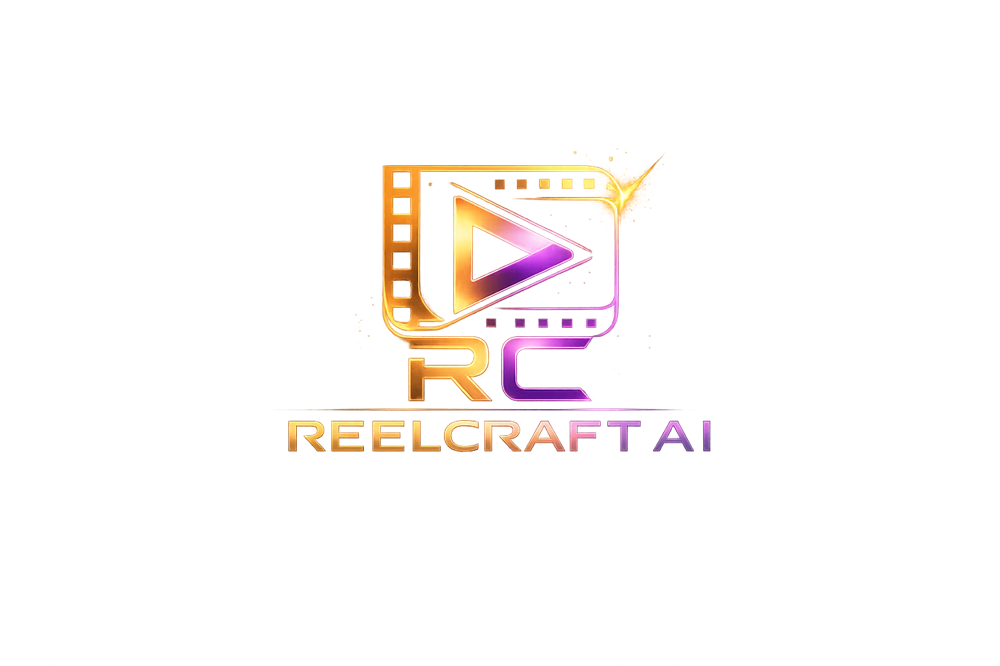
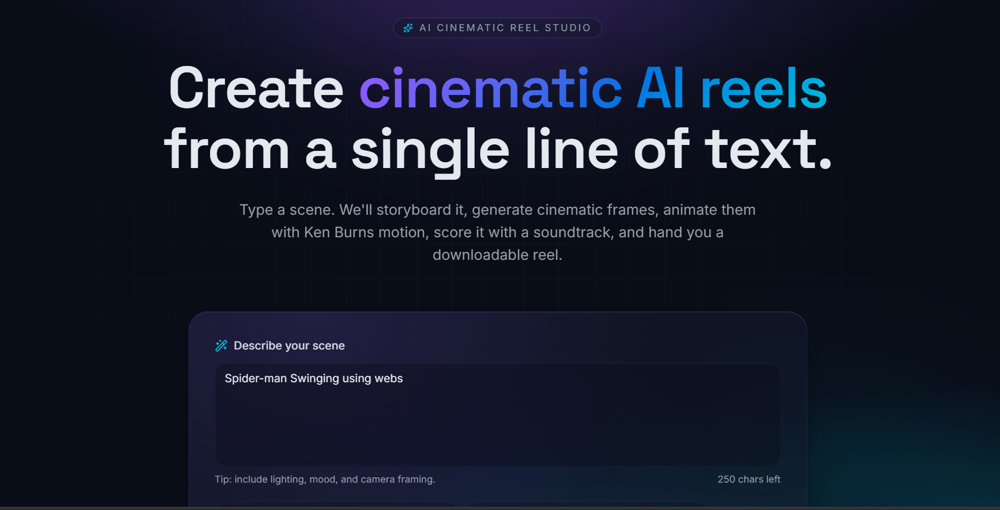
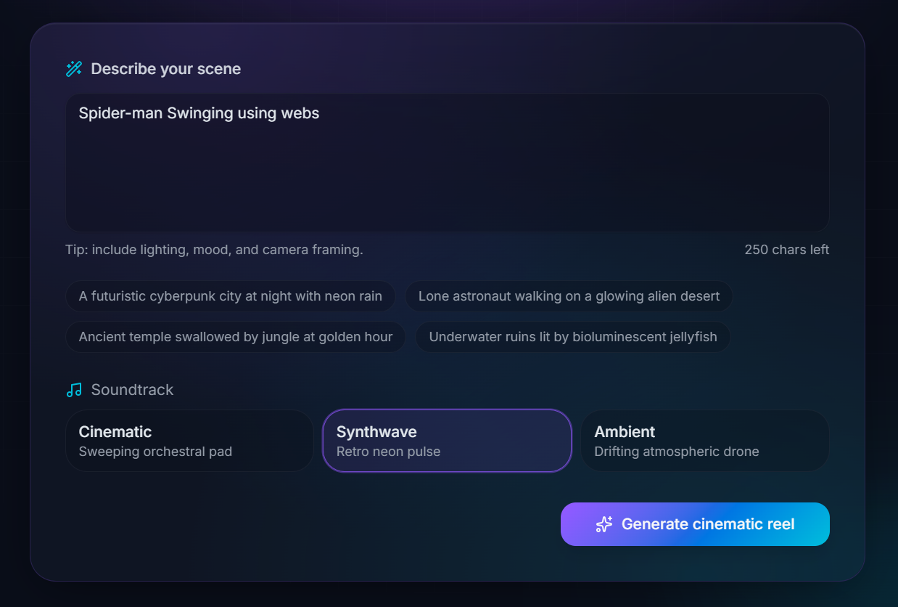
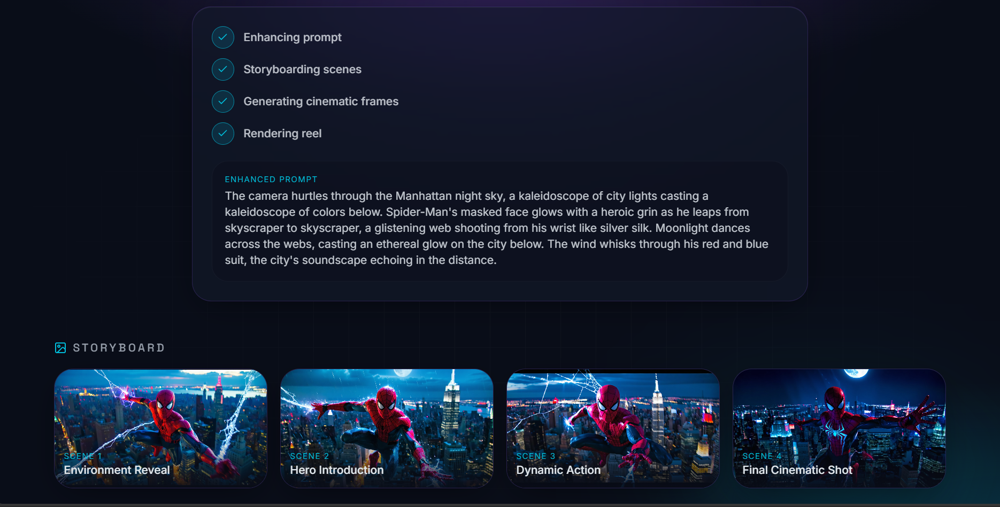
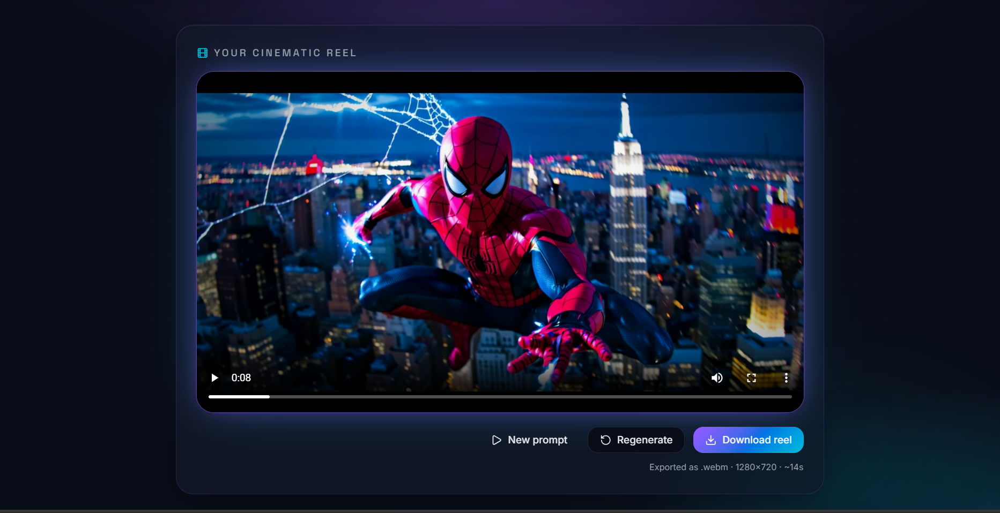

<p align="center">
  
</p>
<h1 align="center">🎬 ReelCraft AI</h1>

<p align="center">
  Create cinematic AI reels from a single line of text.
</p>

An AI-powered cinematic reel generation platform that transforms a single text prompt into enhanced cinematic scenes, storyboard visuals, AI-generated frames, and downloadable animated reels.

---

## 💡 Why This Project?

ReelCraft AI was built to explore how generative AI can assist in cinematic storytelling and rapid visual prototyping.

Instead of manually designing scenes, users can describe an idea in one sentence and instantly generate:
- Cinematic AI prompts
- Storyboard scenes
- AI-generated visual frames
- Animated reel previews

The project combines AI prompt engineering, image generation pipelines, cinematic UI design, and automated reel rendering into a single interactive experience.

---

## 📋 Features

### 🎨 AI Prompt Enhancement
- Converts simple prompts into cinematic scene descriptions
- Adds atmosphere, lighting, mood, and visual storytelling
- Optimized for AI image generation

---

### 🎞️ Storyboard Scene Generation
Automatically generates multiple cinematic scenes:
- Environment Reveal
- Hero Introduction
- Dynamic Action
- Final Cinematic Shot

Each scene uses different cinematic framing styles.

---

### 🖼️ AI Image Generation
- AI-generated cinematic frames
- Stability AI integration
- Pollinations fallback system
- Automatic image fallback handling

---

### 🔄 Intelligent Fallback System

ReelCraft AI includes a multi-level fallback image generation pipeline to prevent application crashes and maintain reel generation even when external AI services fail.

### Fallback Flow

1. **Stability AI**
   - Primary high-quality cinematic image generation
   - Limited by available API credits

2. **Pollinations AI**
   - Automatically used if Stability AI fails or credits are exhausted
   - Generates approximate AI visuals based on the original prompt

3. **Picsum Photos**
   - Final emergency fallback
   - Prevents broken UI or crashes by supplying placeholder cinematic imagery

This ensures the application always remains functional and can continue generating storyboard reels under different API availability conditions.

### 🔁 Rendering Flow

```text
User Prompt
      ↓
Prompt Enhancement
      ↓
Stability AI
      ↓ (fails)
Pollinations AI
      ↓ (fails)
Picsum Fallback
      ↓
Cinematic Reel Renderer
      ↓
Downloadable Video Output
```
---

### 🎥 Reel Rendering
- Generates animated cinematic reels
- Smooth Ken Burns-style motion
- Downloadable `.webm` reel export

---

### 🎵 Soundtrack Selection
Includes cinematic soundtrack presets:
- Cinematic
- Synthwave
- Ambient

---

### 🌌 Modern Cinematic UI
- Responsive futuristic interface
- Dark cinematic aesthetic
- Animated gradients and transitions
- Mobile-friendly layout

---

## 🚀 Quick Start

### Prerequisites

- Python 3.10
- Node.js 18+
- npm
- Git

---

## ⚙️ Installation

### Clone the repository

```bash
git clone https://github.com/gopalthakare/reelcraft-ai.git
```

### Move into the project directory

```bash
cd reelcraft-ai
```

### Install dependencies

```bash
npm install
```

---

### 🔑 Environment Variables

Create a `.env` file in the root directory:

```env
GROQ_API_KEY=your_groq_api_key
STABILITY_API_KEY=your_stability_api_key
```

---

### ▶️ Running the Application

Start the development server:

```bash
npm run dev
```

Open the application:

```text
http://localhost:8080
```

---

## 📸 Screenshots

### 🖥️ Landing Page



---

### ✍️ Prompt Input Interface



---

### 🎞️ Storyboard Generation



---

### 🎥 Final Reel Output



---

## 📁 Project Structure

```text
reelcraft-ai/
├── public/                     # Static assets
│
├── src/
│   ├── components/             # UI components
│   ├── hooks/                  # Custom hooks
│   ├── lib/                    # AI generation logic
│   ├── routes/                 # App routes
│   ├── router.tsx              # Router setup
│   ├── server.ts               # Server entry
│   ├── start.ts                # App bootstrap
│   └── styles.css              # Global styles
│
├── screenshots/                # screenshots
│
├── .env                        # Environment variables
├── package.json
├── vite.config.ts
└── README.md
```

---

## 🛠️ Technology Stack

### Frontend
- React 19
- TypeScript
- TanStack Start
- Tailwind CSS
- Framer Motion

---

### AI & Generation
- Groq API
- Stability AI
- Pollinations AI

---

### Development
- Python
- Vite
- Node.js
- npm

---

## 🧠 How It Works

### 1. User Prompt
User enters a cinematic idea.

Example:
```text
Spider-Man swinging through a futuristic neon city
```

---

### 2. AI Prompt Enhancement
The system enhances the prompt with:
- cinematic lighting
- atmosphere
- camera framing
- emotional tone
- environmental storytelling

---

### 3. Storyboard Generation
Multiple cinematic scenes are generated automatically.

---

### 4. AI Frame Generation
Each scene is converted into cinematic AI-generated images.

---

### 5. Reel Rendering
Frames are animated into a cinematic reel preview.

---

## 📦 Build for Production

```bash
npm run build
```

---

## 🔮 Future Improvements

- 🎙️ AI voice narration
- 🎵 Dynamic soundtrack generation
- 🎬 Real AI video generation
- ☁️ Cloud rendering support
- 📱 Mobile app version
- 🧠 Multi-scene memory system
- 🎭 Character consistency system

---

## 🐛 Troubleshooting

### Missing API Key

Error:
```text
Missing GROQ_API_KEY
```

Solution:
Make sure `.env` exists and contains valid API keys.

---

### Image Generation Fails

Possible causes:
- Stability AI credits exhausted
- Pollinations API unavailable

The app automatically falls back to alternative image sources.

---

## 📄 License

This project is licensed under the MIT License - see [LICENSE](LICENSE) file for details.

---

## 👨‍💻 Author

Gopal Thakare

GitHub: https://github.com/gopalthakare

---
